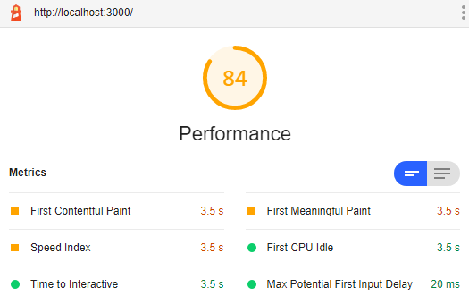

## Performance
This section can be skipped at first reading. You might prefer go back to the [README](../../README.md).
### Benchmarks
To benchmark the solution perform the following steps:

1. If the [Getting Started](../../README.md#getting-started) section has been completed, skip this step. Otherwise clone the repository and build the solution:
    ```
    git clone https://github.com/winwiz1/crisp-react.git
    cd crisp-react
    yarn install && yarn build:prod
    ```
2. Start the backend:
    ```
    yarn run:prod
    ```

3. Start Chrome and open new incognito window to disable extensions. Point it to `localhost:3000.`  The Overview page should appear.

4. Press F12 to open Chrome DevTools, then activate the `Audits` tab. Choose the settings:
    ```
    Device: Desktop
    Audits: Performance
    Throttling: No throttling
    Clear storage: ticked
   ```
5. Run the audit. Then change `Throttling` to `Simulated Slow 4G, 4x CPU Slowdown` and run the audit again. The results should be similar to shown in the table:

    | Throttling | Benchmark Results |
    | :---:| :---:|
    | not throttled |  |
    | throttled to slow 4G,<br/>CPU slowdown |  |

    As you can see, throttling results in 16% performance drop only. Switching from Desktop to Mobile produces slightly longer First Meaningful Paint and other metrics with the same performance scores.

6. Terminate the backend by pressing `Control+C`.

### Future Considerations
The solution has a limited amount of code, as a boilerplate should. It begs a question to what extent the performance will be affected when the application grows. To contemplate an answer let's have a look at the script bundles:

| Bundle | Description | Brotli-compressed size in production build / development build size
| :---:| :---| :---:|
| `first.<hash>.js` | Renders the SPA called 'first' | 6 Kb / 64 Kb |
| `second.<hash>.js` | Renders the SPA called 'second' | 8 Kb / 24 KB |
| `vendor.<hash>.js` | Contains dependencies from `client/node_modules/`. Reused among SPAs.  | 77 Kb / 3.6 MB|
| `runtime.<hash>.js` | Webpack utility bundle. Contains internal webpack code. Reused among SPAs. | 2 Kb / 7 Kb |

>Sidenote. The bundles are located in the `client/dist` directory created during builds. We take Brotli compression (with `.br` file extension) into account because on the one hand it delivers approximately 17% better compression than gzip and on the other hand all modern browsers support it and have supported it for quite a while. Some bundles are too small to benefit from compression and are left uncompressed in which case we take the uncompressed size. 

>To inspect bundle sizes in different builds, switch between development and production by executing `yarn build` or `yarn build:prod` from the `client/` subdirectory.

Let's assume that at the beginning of the development the second SPA and its bundle were removed (by commenting it out in the SPA Configuration) so the React app contains a single SPA only called 'first'. With the anticipated application growth the `first` bundle is expected to grow rapidly to reflect the expanding functionality and codebase. The `vendor` bundle is expected to grow at much slower pace because it already contains the bulk of dependencies (project dependencies including the React library, its direct dependencies, dependencies of the dependencies and so forth).

No substantial impact on the performance can be anticipated until the `first` bundle reaches the size and then outgrowths the `vendor` bundle. At this point it might be a good time to use code splitting and introduce another SPA. One of the goals of using multiple SPAs is to ensure each SPA is rendered by its own and smaller bundle thus reducing React application loading time. See [SPA Configuration](../../README.md#spa-configuration) section for more details.

The conclusion is that with multiple SPAs you can grow the functionality and codebase while maintaining the top performance.

---
Back to the [README](../../README.md).
